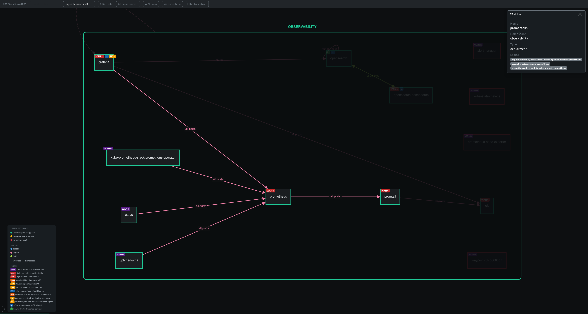

# network-policy-visualizer

> **A Kubernetes policy reachability & gap analyzer.**
> Computes the *effective* reachability between workloads across NetworkPolicy, Istio AuthorizationPolicy, and ambient mesh mTLS — then flags the gaps. Read-only by design, runs as a local binary.

**Stop guessing what your pods can actually reach.**

Policy is written per-engine and per-namespace, but reachability is *emergent* — no one can answer "can A reach B, and why?" by reading YAML. This tool resolves all three layers into the effective answer and shows, at a glance, who can talk to whom across **Kubernetes NetworkPolicy**, **Istio AuthorizationPolicy**, and **Istio ambient mesh mTLS** — and flags the workloads that are silently wide open or silently broken.

Built for SREs, platform / ops engineers, and DevOps teams running multi-tenant clusters where "is this locked down?" and "why can't A reach B?" eat half the on-call rotation.


---

## The problem

Modern Kubernetes pod-to-pod security is a layer cake:

- **K8s NetworkPolicy** — L3/L4, default-open until something selects you, then default-deny in the locked direction.
- **Istio AuthorizationPolicy** — L4 + L7, ALLOW + DENY semantics, ingress-only, ignored entirely if the workload isn't in the mesh.
- **Istio ambient mesh** — ztunnel handles L4 + mTLS without sidecars, but only for pods enrolled via `istio.io/dataplane-mode: ambient`. mTLS posture comes from `PeerAuthentication` with a global → namespace → workload precedence chain.

Each layer is hard to reason about alone. Stacked together, the failure modes multiply:

- A pod with **zero policies is wide open by default** — and `kubectl get networkpolicies` never lists the workloads that lack one. The gap is invisible.
- The **two policy engines have different semantics**. K8s NP locks once any policy selects the workload. Istio AuthZ stacks ALLOW + DENY. Effective reachability is an **AND across engines** — a workload allowed by one and blocked by another is blocked at runtime.
- **Ambient mesh enrollment is a single label** — easy to set, easy to miss, easy to override at the wrong scope. An AuthorizationPolicy on a non-enrolled pod reads like enforcement and does nothing.
- **PeerAuthentication STRICT silently breaks legacy clients**. A non-mesh caller hitting a STRICT destination fails at the transport layer, before any policy is even evaluated.
- **Ambient + NetworkPolicy is a footgun.** Ambient traffic is delivered to pods via ztunnel on HBONE port **15008**. A port-restricted NetworkPolicy that doesn't allow 15008 silently drops every mesh-routed packet — the workload looks healthy, mesh traffic just disappears.
- Cross-namespace intent is opaque — a policy in `ns-A` allowing `ns-B` only makes sense if you have both namespaces' labels open in another tab.

Reading three layers of YAML in three languages and intersecting them in your head is not a reliable workflow. This tool does the resolution and puts the whole picture on one screen.

---

## What it shows

### 1. The graph — every policy, every engine, on one canvas

Live nodes for every pod, cronjob, and namespace; edges for everything each policy permits or denies.

- Edges are **tagged by engine**. K8s and Istio render as separate edges between the same pair, so you immediately see when one engine allows traffic the other blocks.
- **Direction-aware arrows** (ingress / egress / both) and explicit `DENY` styling for Istio deny rules — explicit deny is a different signal from "no allow matched."
- L7 details (hosts, methods, paths) attached to Istio edges for click-through inspection.
- Namespace-level rollup view collapses each ns to one node — perfect for tenant-isolation spot checks.

### 2. Status badges — who's exposed, who's air-gapped, at a glance

Each workload wears badges computed from the **union of every selecting policy across every engine**, intersected so a workload only earns an "open" badge if every engine permits it.

| Badge | When it fires |
|---|---|
| `WAN⇆` | Internet reachable both directions — **including any pod with no policy at all** (default-open is the headline footgun). |
| `WAN↑` / `WAN↓` | One direction locked, the other reaches `0.0.0.0/0`. |
| `LAN⇆` / `LAN↑` / `LAN↓` | Explicit `ipBlock` peer targets a private LAN outside the cluster. |
| `API↑` | Egress reaches a configured Kubernetes API-server CIDR. |
| `⊘` | Both directions locked, no escape hatch — properly air-gapped. |
| `⇆` | Peer namespaceSelector targets a different namespace. |
| `NS⇆` / `NS↑` / `NS↓` | Catch-all peer matches every pod in the same namespace. |
| `L7` | Istio AuthorizationPolicy uses L7 matchers — reachability depends on HTTP attributes the graph can't fully simulate. |

The badge to hunt for in practice: **`WAN⇆` on workloads you didn't expect to be public**. That's almost always a missing policy.

### 3. Reachability checks — "can A actually reach B?" answered across all three layers

Pin a source workload, click any destination. A side-by-side panel renders the verdict per layer:

- **K8s NetworkPolicy** — which policies select each end, which allow / deny rules matched per direction, whether the path is locked or open.
- **Istio AuthorizationPolicy** — same breakdown, with L7 matchers shown when present.
- **Istio mesh / mTLS** — src and dst membership (in mesh? ambient?), the resolved PeerAuthentication mode on each side (STRICT / PERMISSIVE / DISABLE), and a transport-layer verdict. STRICT destination + non-mesh source → mesh blocks, even when both policy engines would allow it.

If k8s says yes but Istio says no, the panel makes that explicit instead of hiding it behind a single boolean. If both policy engines allow but the mesh transport layer denies, that's surfaced too — with the exact PeerAuthentication object that forced the verdict.



### 4. Ambient mesh misconfiguration detector

Clicking any workload runs cross-cutting validators that don't fit inside a single policy or mesh entry. The headline one today:

> **"This workload is in the Istio ambient mesh, but its NetworkPolicy only allows ingress on port(s) `[8080]`. Ambient delivers traffic through ztunnel on port 15008, which is blocked. Add an ingress rule allowing TCP port 15008 so mesh traffic can reach the workload."**

This catches the single most common ambient rollout failure: a perfectly valid NetworkPolicy and a perfectly valid AuthorizationPolicy that, together, silently null out every packet ztunnel tries to deliver. The visualizer flags it on the workload, with the exact ports that need to be added.

---

## Who this is for

**SREs on call.** "Service A can't reach service B" stops being a 40-minute YAML excavation. Pin A, click B, read the verdict per engine + mesh. Often the answer is right there: "Istio AuthZ is fine, k8s NP doesn't allow it" or "PeerAuthentication STRICT on the destination, source isn't enrolled in the mesh."

**Platform / ops engineers rolling out mesh.** Enrolling a namespace in ambient is a one-label change. The downstream effects — NetworkPolicy interop, PeerAuthentication precedence, AuthorizationPolicy enforcement scope — are not obvious until something breaks. The visualizer shows membership, mTLS posture, and the ambient-vs-NP port trap before you ship the rollout.

**DevOps engineers inheriting a cluster.** Helm-installed everything looks fine in `kubectl get pods`. Open the visualizer, switch to a workload namespace, every pod wearing `WAN⇆` is reachable from the public internet — or has no policy at all and defaults to it. Triage from there.

**Security review and audit.** Filter on `WAN⇆` / `WAN↑`. Every workload that can reach `0.0.0.0/0` egress lights up. Screenshot, send. No grepping policy YAMLs across namespaces, no missing the workloads that have no policy to grep for.

---

## When you'd actually use it

**"I inherited this cluster — what's exposed?"**
Open the visualizer. Every `WAN⇆` badge is a workload reachable from the public internet — or, more often, a workload with no policy that defaults to it. Those are the first questions to ask.

**"The Helm chart said it has network policies — does it really?"**
Most upstream charts ship policies for a handful of components. The graph shows which workloads in the chart's namespace got covered and which the chart silently skipped.

**"We just enabled ambient on this namespace. Did anything break?"**
Click any workload in the namespace. The detail panel shows mesh membership, the resolved PeerAuthentication, and any cross-cutting issues — including the ztunnel-port-15008 NetworkPolicy trap.

**"Service A can't reach service B — whose fault is it?"**
Pin A, click B. The reachability panel breaks down the verdict per engine + mesh. The blocking layer is named explicitly.

**"We're rolling out STRICT mTLS — what breaks?"**
Filter the graph by workloads currently outside the mesh, then run reachability checks from them into the soon-to-be-STRICT namespace. Any "allow → deny" flip is a client that needs to be enrolled or exempted before you ship.

**"A pod got compromised — what could it have reached?"**
Click the workload. Every outbound edge — pods, namespaces, CIDRs, ports — is in the detail panel. Faster than reconstructing it from policy files during an incident.

**"I'm about to add a deny-all default policy — will anything break?"**
Run the tool against the current cluster first. Anything currently showing `WAN⇆` without an obvious reason is what will break. Lock those down explicitly before flipping the default.

**"I want to verify tenants can't reach each other."**
Aggregate-by-namespace view collapses each ns into one node. Cross-namespace edges between tenant namespaces are immediately visible — or, ideally, absent.

---

## Quick start

Against your live cluster:

```bash
go build -o graph .
KUBECONFIG=~/.kube/config ./graph
# UI → http://localhost:8080
```

The binary embeds the built UI — single static binary, no separate frontend deploy. Read-only on your cluster (it only `LIST`s pods, namespaces, NetworkPolicies, Istio AuthorizationPolicies, and Istio PeerAuthentications — when the CRDs are installed).

Demo mode (no cluster required):

```bash
DEMO_MODE=true ./graph
```

Loads sample data from embedded `test-data/` — includes a real `observability` namespace dump showing partial NetworkPolicy coverage as it actually appears in production, plus curated Istio scenarios (DENY rules, L7 ALLOW with hosts / methods / paths, ambient mesh enrollment with PeerAuthentication precedence).

## RBAC

Minimum permissions:

```yaml
rules:
  - apiGroups: [""]
    resources: ["pods", "namespaces"]
    verbs: ["get", "list"]
  - apiGroups: ["networking.k8s.io"]
    resources: ["networkpolicies"]
    verbs: ["get", "list"]
  - apiGroups: ["batch"]
    resources: ["cronjobs"]
    verbs: ["get", "list"]
  # Optional — only required if Istio is installed and you want AuthZ + mesh in the graph.
  - apiGroups: ["security.istio.io"]
    resources: ["authorizationpolicies", "peerauthentications"]
    verbs: ["get", "list"]
```

## Development

```bash
go test ./...                          # unit tests for graph + policy + mesh + reachability logic (no cluster needed)
cd ui && npm install && npm run dev    # Vite dev server on :5173, proxies /api → :8080
```

The frontend sends `?namespaces=a,b` and the backend queries only those. Per-namespace fetches run concurrently. Mesh / mTLS resolution is **lazy** — PeerAuthentications are fetched only when a workload is clicked or a reachability check runs, so the graph payload stays cheap. No watches, no caching layer — every request hits the API server fresh, so the picture is always live.

For architecture detail see the ADRs in [`docs/arch/`](docs/arch/) — in particular [`0003-istio-mesh-membership-and-mtls.md`](docs/arch/0003-istio-mesh-membership-and-mtls.md) for the mesh integration design — and [`docs/status-key-computation.md`](docs/status-key-computation.md). Dev container setup is in [`CLAUDE.md`](CLAUDE.md).
