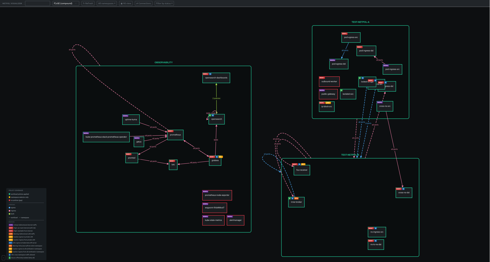
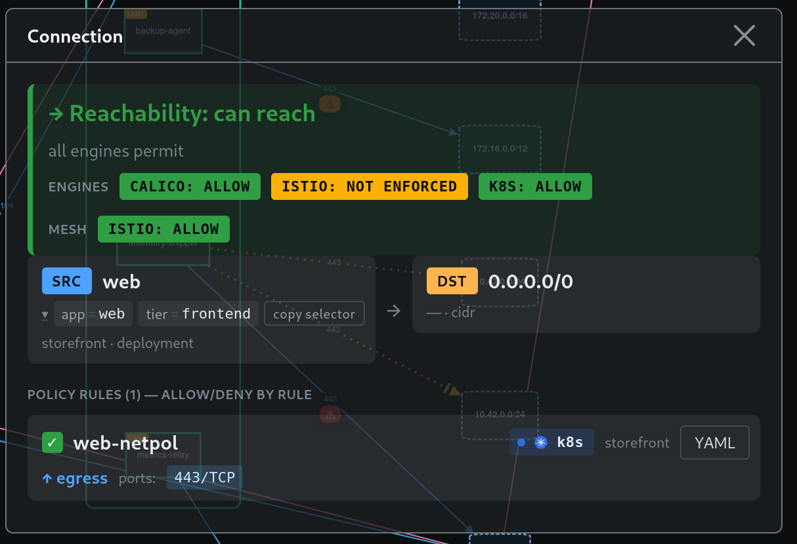
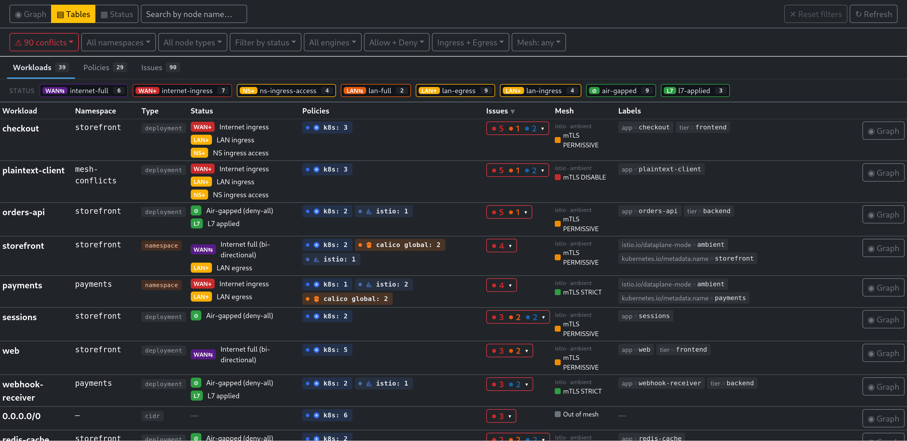
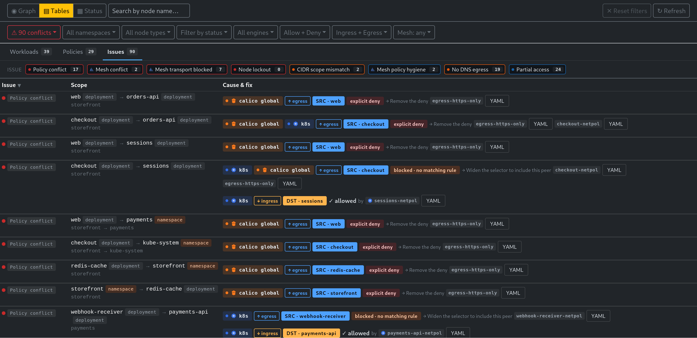
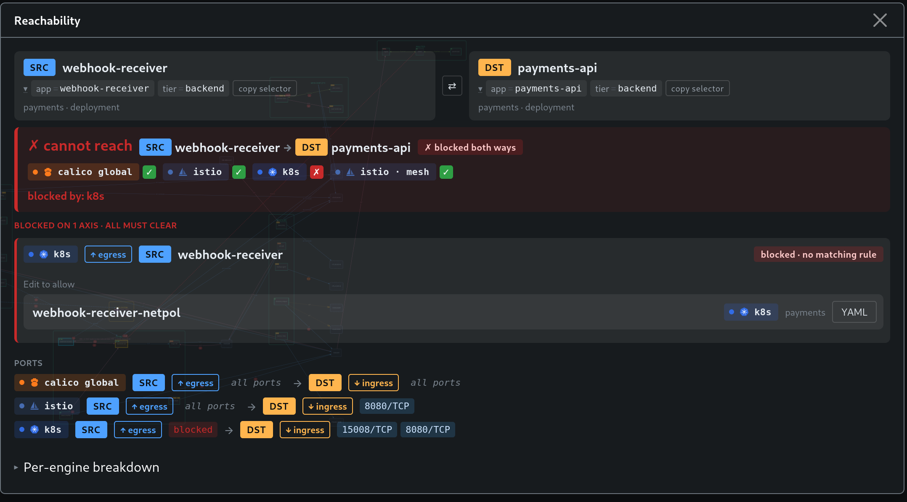

# network-policy-visualizer

> **A Kubernetes policy reachability & gap analyzer.**
> Resolves what your pods can actually reach across NetworkPolicy, Istio AuthorizationPolicy, Calico GlobalNetworkPolicy, and ambient-mesh mTLS — then shows the gaps and cross-engine conflicts. Read-only by design, runs as a single static binary.

**Stop guessing what your pods can actually reach.**

Policy is written per-engine and per-namespace, but reachability is *emergent*. No one can answer "can A reach B, and why?" by reading YAML in three places. This tool intersects all the layers and puts the answer on one screen.



---

## At a glance

| Surface | What it answers | Where |
|---|---|---|
| **Policy graph** | "Who can talk to whom, under which engine's rules?" Every workload kind, CIDR peer, and namespace as a node; one edge per engine per pair, allow and deny. | [details](#graph-view) |
| **Edge panel** | "This arrow says allow — is the traffic actually getting through?" Cross-engine verdict per connection, every firing rule with ports and L7. | [details](#edge-panel) |
| **Reachability check** | "Can A reach B, and who's blocking it?" Pin source, click destination, verdict per layer with the blocking policy named. | [details](#reachability-check) |
| **Cluster Status metrics** | "Do I have a fire?" Exposure callout, policy-coverage stats, status severity bar, mesh rollup, top-risky workloads, per-namespace drill-down. | [details](#cluster-status-metrics) |
| **Tables view** | "List every workload with `internet-ingress`." Sortable, filterable workload + policy tables, spreadsheet-ready. | [details](#tables-view) |
| **Issues** | "What's misconfigured right now?" Eight detectors — cross-engine conflicts, mesh traps, DNS gaps, CIDR mistakes — each with severity and named culprit. | [details](#issues) |
| **CLI report** | "Fail the PR before this reaches a cluster." Same analysis over a manifest directory — table or JSON, no server, no cluster. | [details](#cli-report) |
| **Status badges** | "What's exposed?" 13-key vocabulary per workload (`WAN⇆`, `LAN↑`, `⊘`…), intersected across every engine. | [details](#status-badges) |

Three ways to run it:

```bash
KUBECONFIG=~/.kube/config ./graph           # live cluster  → UI on :8080
./graph -f ./manifests                      # manifest dir  → UI on :8080, no cluster, 
./graph -f ./manifests --report             # manifest dir  → report to stdout, exits
```

---

## The problem

Modern Kubernetes pod-to-pod security is a layer cake, and the layers do not talk to each other:

- **K8s NetworkPolicy** — L3/L4. Default-open until something selects you, then default-deny in the locked direction.
- **Istio AuthorizationPolicy** — L4 + L7, ALLOW + DENY, ingress-only. Ignored entirely if the workload is not in the mesh.
- **Istio ambient mesh** — ztunnel handles L4 + mTLS, but only for pods labeled `istio.io/dataplane-mode: ambient`. mTLS posture comes from `PeerAuthentication` with a global → namespace → workload precedence chain.
- **Calico `GlobalNetworkPolicy`** — cluster-scoped, tiered, ordered first-match. Cluster-wide `Pass` / `Allow` / `Deny` verdicts override or shadow namespace-scoped rules. Nothing in `kubectl get networkpolicies` even hints these exist.

Each layer is hard to reason about alone. Stacked, the failure modes multiply:

- A pod with **zero policies is wide open by default**. `kubectl get networkpolicies` never lists the workloads that lack one. The gap is invisible.
- The **two policy engines have different semantics**. Effective reachability is an **AND across engines** — a workload allowed by one and blocked by another is blocked at runtime. The graph everyone draws by hand is a lie.
- **Ambient mesh enrollment is a single label** — easy to set, easy to miss, easy to override at the wrong scope. An `AuthorizationPolicy` on a non-enrolled pod reads like enforcement and does nothing.
- **PeerAuthentication STRICT silently breaks legacy clients**. A non-mesh caller hitting a STRICT destination fails at the transport layer before any policy is even evaluated.
- **Ambient + NetworkPolicy is a footgun.** Ambient traffic is delivered via ztunnel on HBONE port **15008**. A port-restricted NetworkPolicy that does not allow 15008 silently drops every mesh-routed packet — the workload looks healthy, mesh traffic just disappears.

Reading three layers of YAML in three languages and intersecting them in your head is not a reliable workflow. This tool does the resolution.

---

## Who it's for

**SREs on call.** "Service A can't reach service B" stops being a 40-minute YAML excavation. Pin A, click B, read the verdict per engine + mesh. The blocking layer is named.

**Platform / ops engineers rolling out mesh.** Enrolling a namespace in ambient is one label. The downstream effects (NetworkPolicy interop, PeerAuthentication precedence, AuthorizationPolicy scope) are not obvious until something breaks. This shows membership, mTLS posture, and the ambient-vs-NP port trap before you ship.

**DevOps engineers inheriting a cluster.** Helm-installed everything looks fine in `kubectl get pods`. Open the visualizer, every pod wearing `WAN⇆` is reachable from the public internet — or has no policy at all and defaults to it. Triage from there.

**Security review and audit.** Filter on `WAN⇆` / `WAN↑`. Every workload that can reach `0.0.0.0/0` lights up. The Tables view lists the same data row-by-row, sortable and filterable for spreadsheet handoff.

---

## What's in the product today

### Graph view

*Every policy, every engine, on one canvas.*

Nodes for every workload kind — Deployment, StatefulSet, DaemonSet, CronJob, standalone Job, bare pod — plus CIDR peers and namespaces. Edges for everything each policy permits or denies, **tagged by engine**, so one engine allowing what another blocks is visible at a glance.

- **Per-engine edges** — k8s NetworkPolicy, Istio AuthorizationPolicy, and Calico GlobalNetworkPolicy each render their own edge between the same pair. No merged, averaged, or invented verdict.
- **Per-kind silhouettes** — cut-rectangle StatefulSet, pentagon DaemonSet, hexagon CronJob, notched hexagon Job, ellipse for an uncontrolled pod. Decoded in the legend's **Node shapes** block, togglable per kind in the filter panel.
- **Direction + action styling** — ingress / egress / both arrows, explicit DENY styling for Istio and Calico deny rules.
- **L7 on the edge** — hosts, methods, paths attached to Istio edges.
- **CIDR peers as real nodes** — including `ipBlock.except` carve-outs, so "allow 10.0.0.0/8 except 10.0.5.0/24" is on the canvas instead of buried inside the rule.
- **Namespace rollup** — collapses each ns to one node for tenant-isolation checks.
- **Status badges per workload** ([vocabulary below](#status-badges)) — computed from every selecting policy across every engine, intersected so a workload only earns an "open" badge if every engine permits it.

### Edge panel

*The connection's full truth — what every engine says about this one arrow.*

Click any arrow. Header states the cross-engine reachability verdict (`→ Reachability: can reach` / `✗ Reachability: cannot reach`) with per-engine badges — `CALICO: ALLOW`, `ISTIO: NOT ENFORCED`, `K8S: ALLOW`, plus `MESH: <mode>`. Below the header: SRC + DST workload cards, then a `POLICY RULES` section listing every rule that fired with its engine, namespace, direction, and ports (L7 matchers when present).

The arrow on canvas is one engine's opinion. The banner is the truth across every engine and the mesh. When they disagree, the lying-graph trap surfaces immediately — no guessing why "the policy says allow but traffic dies."



### Tables view

*Audit, hygiene, search — the same data as rows.*

Two sortable, filterable tables sharing the same filters as the graph:

- **Workloads** — namespace, type, effective status keys, per-engine policy counts, labels. Row click opens the detail panel inline; explicit `◉ Graph` button when you want the spatial view. A status-rollup strip across the top counts every status key live and pivots the table when you click a chip.
- **Policies** — one row per `(engine, namespace, policy name, action)`. Rules + endpoints columns surface how broad each policy is. Click a row → drill into every workload it actually affects. Engine-rollup strip across the top counts policies per engine.

Built for the auditor's question: "show me every workload with `internet-ingress`" or "list every policy selecting more than N workloads." Answer in two clicks.



### Cluster Status metrics

*The "should I be worried" page — cluster-wide numbers, not individual arrows.*

One operator-facing overview scoped by the same filters as the graph. Scan order matches the on-call flow:

- **Red exposure callout** — every public-facing pod with no policy at all, named. This is the page-worthy finding.
- **Rule coverage + protection stats** — how many workloads are selected by at least one engine, how many are covered by *every* enabled engine, how many are covered by only one (single-engine coverage is a silent-failure risk once a second engine ships).
- **Node status severity bar** — the worst status key per workload as a partitioned bar, so `WAN⇆` doesn't get double-counted with `LAN⇆`.
- **Cluster + per-namespace mesh rollup** — ambient vs sidecar vs no-mesh breakdown, plus resolved PeerAuthentication mode.
- **Top-risky workloads table** — sorted by severity, click through to detail panel.
- **Namespace drill-down** — coverage + status breakdown per namespace.

Nothing here is derived data the graph doesn't have — it's the same evaluation results, reshaped for the "walk in, decide if you have a fire" workflow.

### Issues

*Cross-cutting conflicts and hygiene findings the graph can't draw as one arrow.*

`/api/issues` runs seven detectors over the current evaluation and surfaces findings the graph can't show as a single arrow. Rendered inline as the **Issues** tab in the Tables view and as a scoped list in every workload's detail panel.

| Detector | What it catches | Where it lives |
|---|---|---|
| **Policy conflict** | One engine allows a path, another (engine or mesh) denies it. Walks every allow pair with the same probe as `/api/reachable`. | `internal/store/buildIssues.go` (`PolicyIssues`) |
| **Mesh conflict** | STRICT destination blocks a pair every policy engine otherwise permits. Surfaced as a side-effect of the reachability walk — no standalone hygiene sweep, so a STRICT PA with no allowed caller today will not appear. | `internal/store/buildIssues.go` |
| **Mesh transport blocked** | L3 policy strips a port the mesh dataplane needs — today ambient's ztunnel HBONE port 15008. Detected per-workload at graph build. | `internal/mesh/istio/detect.go` (`ValidateExternalRules`) |
| **Mesh policy hygiene** | PeerAuthentication duplicates, root-namespace selectors that Istio ignores, unset fallback modes. | `internal/mesh/istio/buildMeshMembership.go` |
| **No DNS egress** | Locked-down egress with no rule allowing port 53. Two false-positive filters skip: workloads with no egress opinion at all (`ReasonNoOpinion`) and workloads whose matching egress rule already permits every port. | `internal/store/buildIssues.go` |
| **Partial access** | Selector matches multiple pods but only some are reachable through the intended path — usually a stale label selector or a partial rollout. | `internal/store/buildIssues.go` (`IssuesPartial`) |
| **CIDR scope mismatch** | Rule targets a CIDR that overlaps but does not fully contain the intended peer's address — an easy miss when copy-pasting CIDR ranges. | `internal/store/buildIssues.go` (`IssuesCidrScope`) |
| **Fetch failed (posture unknown)** | A PeerAuthentication read failed for the root namespace or a workload namespace. Rather than resolve mTLS mode from partial data and render a verdict that might be wrong, the failure itself is surfaced as a finding naming the namespace and the error. | `internal/mesh/istio/buildMeshMembership.go` |

Each finding names the exact policy / workload / port so the fix is `kubectl edit`, not a scavenger hunt. Every finding also carries a `severity` (`critical` / `high` / `warning` / `caution` / `info` / `secure`) stamped from one table — `SeverityForType` in `internal/models/issues.go` — so ranking is identical in the drawer, the tables, and the CLI report. `info` findings are expected layering, not work; counts separate them out as informational.



### Reachability check

*"Can A actually reach B?" — answered across all three layers.*

Pin a source, click any destination. A side-by-side panel renders the verdict per layer:

- **K8s NetworkPolicy** — which policies select each end, which allow / deny rules matched per direction, whether the path is locked or open.
- **Istio AuthorizationPolicy** — same breakdown with L7 matchers shown.
- **Istio mesh / mTLS** — src + dst mesh membership, resolved PeerAuthentication mode on each side, transport-layer verdict. STRICT destination + non-mesh source → mesh blocks, even when both policy engines allow.

The exact PeerAuthentication object that forced the mesh verdict is named.



### Per-workload issue surfacing

*The same findings, scoped to the workload you clicked.*

Every workload's detail panel replays the subset of `/api/issues` that touches it. The headline example — the ambient HBONE trap:

> **"Policy does not allow ztunnel HBONE port 15008; ambient ingress traffic is blocked."**

Same detector fires in the Issues drawer, scoped to what you're looking at. Catches a common ambient rollout failure: a perfectly valid NetworkPolicy and a perfectly valid AuthorizationPolicy that, together, silently null out every packet ztunnel tries to deliver.

### CLI report

*Same analysis, no browser, no cluster — a pre-merge gate.*

`-report` runs one scan over a manifest directory, prints the result, and exits. No server, no UI, no cluster. Same engines, same detectors, same severity table as the web view — a manifest tree gets audited before it ever reaches a cluster.

```bash
./graph -f ./manifests -report                             # human-readable table on stdout
./graph -f ./manifests -report -format json                # machine-readable on stdout
./graph -f ./manifests -report -output scan.json           # table on stdout AND JSON artifact
```

Table output is a triage surface: coverage totals (with and without global policies counted), a severity summary line, a per-type breakdown, then one row per actionable finding, worst first. Informational findings are counted, not listed.

JSON output is a stable, `jq`-friendly document (`cli/types.go`) — counts and metrics first, per-finding detail last. `-output` writes the JSON file *and* keeps the table on stdout, so one invocation gives a readable CI log and an artifact. Logs go to stderr, so stdout only ever carries the chosen format.

Exit code is `2` on a failure to scan (missing `-f`, unreadable directory, bad `-format`), `0` otherwise. Findings do not currently change the exit code — gate CI on the JSON counts.

---

## Status badges

Computed per workload from the intersection of every selecting policy across every engine. The UI renders both the glyph and the slug (e.g. `WAN⇆ internet-full`) — both come from the same catalog in `ui/src/data/policies.ts`.

| Glyph | Slug | Severity | When it fires |
|---|---|---|---|
| `WAN⇆` | `internet-full` | critical | Internet reachable both directions — **including any pod with no policy at all** (default-open is the headline footgun). |
| `WAN↑` | `internet-egress` | high | Egress reaches `0.0.0.0/0` (exfil risk). |
| `WAN↓` | `internet-ingress` | high | Ingress from `0.0.0.0/0` — public-facing. |
| `LAN⇆` | `lan-full` | warning | Bidirectional traffic to/from a private LAN outside the cluster. |
| `LAN↑` | `lan-egress` | caution | Egress to a private LAN. |
| `LAN↓` | `lan-ingress` | caution | Ingress from a private LAN. |
| `NS⇆` | `ns-full-access` | warning | Full access to/from every pod in the same namespace (catch-all peer). |
| `NS↑` | `ns-egress-access` | caution | Egress to every pod in the same namespace. |
| `NS↓` | `ns-ingress-access` | caution | Ingress from every pod in the same namespace. |
| `⇆` | `cross-namespace` | info | Peer namespaceSelector targets a different namespace. |
| `API↑` | `api-server-egress` | info | Egress reaches a configured Kubernetes API-server CIDR. |
| `⊘` | `air-gapped` | secure | Effectively isolated — both directions locked, no escape hatch. |
| `L7` | `l7-applied` | secure | Istio AuthorizationPolicy uses L7 matchers — reachability depends on HTTP attributes the graph can't fully simulate. |

Only the literal `0.0.0.0/0` counts as internet today — a rule targeting a specific public CIDR (e.g. `1.2.3.0/24`) does not flip any `internet-*` key. See `internal/policy/networkPolicyHelpers.go`.

The badge to hunt for in practice: **`WAN⇆` on workloads you did not expect to be public**. That's almost always a missing policy.

---

## When you'd actually use it

- **"I inherited this cluster — what's exposed?"** Every `WAN⇆` is the first question to ask.
- **"The Helm chart said it has network policies — does it really?"** Graph shows which workloads in the chart's namespace got covered and which it silently skipped.
- **"We just enabled ambient on this namespace. Did anything break?"** Detail panel surfaces mesh membership, resolved PeerAuthentication, and the ztunnel-port-15008 NetworkPolicy trap.
- **"Service A can't reach service B — whose fault is it?"** Reachability panel breaks down the verdict per engine + mesh. The blocking layer is named.
- **"We're rolling out STRICT mTLS — what breaks?"** Run reachability from non-mesh workloads into the soon-to-be-STRICT namespace. Any allow → deny flip is a client that needs to be enrolled or exempted before you ship.
- **"A pod got compromised — what could it have reached?"** Every outbound edge is in the detail panel. Faster than reconstructing during an incident.
- **"I want to verify tenants can't reach each other."** Aggregate-by-namespace view collapses each ns into one node. Cross-namespace edges between tenant namespaces are immediately visible — or absent.

---

## Status & roadmap

Today's scope: k8s NetworkPolicy + Istio AuthorizationPolicy + Calico GlobalNetworkPolicy + ambient-mesh mTLS, graph view, tables view, cluster-status dashboard, cross-engine issues drawer, click-driven reachability, headless `-report` scan of a manifest directory. Stable enough to use against a real cluster.

Deferred to later iterations:

- **Operational survival** — cluster-scoped RBAC bundle, response size caps, per-engine failure isolation. Informer-backed cache is wired (`internal/k8s/informerClient.go`), but every `/api/graph` still re-evaluates the full ns set; fine for a few hundred pods, will need debounced snapshotting for thousands.
- **More policy engines** — Cilium `CiliumNetworkPolicy` / `CiliumClusterwideNetworkPolicy` and `AdminNetworkPolicy` (KEP-2091) are the next high-value additions. Each adds real reachability fidelity on clusters that use it.
- **Cluster-state trust signals** — data freshness stamp, per-engine last-success timestamps, partial-render banner when an engine fails. The product is silent today when an engine errors.
- **Policy hygiene linter** — orphan policies, `0.0.0.0/0` ingress without explicit annotation, AuthorizationPolicy principals referencing non-existent ServiceAccounts, shadowed Istio rules. Shippable from existing data; not built yet.
- **Snapshot diff** — "what changed in policy state since 5 minutes ago" for incident timelines.

See [`docs/FEATURES.md`](docs/FEATURES.md) for the ranked wishlist with concrete file-line references.

---

## Quick start

Against your live cluster:

```bash
cd ui && npm install && npm run build && cd ..
go build -o graph .
KUBECONFIG=~/.kube/config ./graph
# UI → http://localhost:8080
```

The Go binary embeds `ui/dist/` via `//go:embed` (see `embed.go`) — the UI build step is required or `go build` fails with `pattern all:ui/dist: no matching files found`. Ship is a single static binary, no separate frontend deploy. Read-only on your cluster.

Demo mode (no cluster required):

```bash
DEMO_MODE=true ./graph
```

Loads sample data from embedded `test-data/demo/` — a curated mid-size SaaS cluster: public storefront + payments tier on an Istio mesh (`20-storefront.yaml`, `30-payments.yaml`), plain-k8s analytics pipeline (`10-analytics.yaml`), private-network connectivity tier (`40-private-net.yaml`), a mesh-conflicts scenario box (`50-mesh-conflicts.yaml`), and Calico globals (`60-calico-globals.yaml`). One namespace per file, applies directly via `kubectl apply -f test-data/demo/`.

Any manifest directory works as a cluster, no `DEMO_MODE` needed:

```bash
./graph -f test-data/scenarios/03-mtls-matrix
```

`test-data/scenarios/` holds small single-purpose clusters (1–3 namespaces) — one per feature area, used for e2e tests. See [`test-data/README.md`](test-data/README.md).

Scan a manifest tree without starting anything:

```bash
./graph -f test-data/scenarios/03-mtls-matrix -report
```

See [CLI report](#cli-report) for formats and exit codes.

## RBAC

Minimum permissions:

```yaml
rules:
  - apiGroups: [""]
    resources: ["pods", "namespaces"]
    verbs: ["get", "list", "watch"]
  - apiGroups: ["networking.k8s.io"]
    resources: ["networkpolicies"]
    verbs: ["get", "list", "watch"]
  - apiGroups: ["batch"]
    resources: ["cronjobs"]
    verbs: ["get", "list", "watch"]
  # Optional — only required if Istio is installed and you want AuthZ + mesh in the graph.
  - apiGroups: ["security.istio.io"]
    resources: ["authorizationpolicies", "peerauthentications"]
    verbs: ["get", "list", "watch"]
  # Optional — only required if Calico is installed and you want GlobalNetworkPolicy in the graph.
  - apiGroups: ["projectcalico.org"]
    resources: ["globalnetworkpolicies"]
    verbs: ["get", "list", "watch"]
```

`watch` is mandatory, not optional — the shared informers issue LIST + WATCH per GVK at startup (`internal/k8s/informerClient.go`). A role granting only `get,list` will fail cache sync and the process exits.

Istio and Calico CRDs are probed at startup — if the API group is absent, the engine is skipped cleanly (no fatal error, no phantom edges).

## Development

```bash
go test ./...                          # unit tests for graph + policy + mesh + reachability logic (no cluster needed)
cd ui && npm install && npm run dev    # Vite dev server on :5173, proxies /api → :8080
```

The frontend sends `?namespaces=a,b` and the backend queries only those. Per-namespace fetches run concurrently across every registered engine (`defaultSources` in `internal/store/buildStore.go`; engine identifiers exposed via `Builder.EngineNames()`). Mesh membership + resolved PeerAuthentication mode are computed eagerly during graph build so every workload node ships with its mesh posture attached — cluster-status rollups and the ambient-HBONE detector don't have to re-query. Informers back the k8s / Istio / Calico reads — warm requests skip the API-server roundtrip — but `/api/graph` still re-evaluates every engine per request; see [`docs/informers.md`](docs/informers.md) for the sync + startup-blocking behavior.

For architecture detail see the ADRs in [`docs/arch/`](docs/arch/) — in particular [`0003-istio-mesh-membership-and-mtls.md`](docs/arch/0003-istio-mesh-membership-and-mtls.md) for the mesh integration design — and [`docs/status-key-computation.md`](docs/status-key-computation.md). Dev container setup is in [`CLAUDE.md`](CLAUDE.md).
