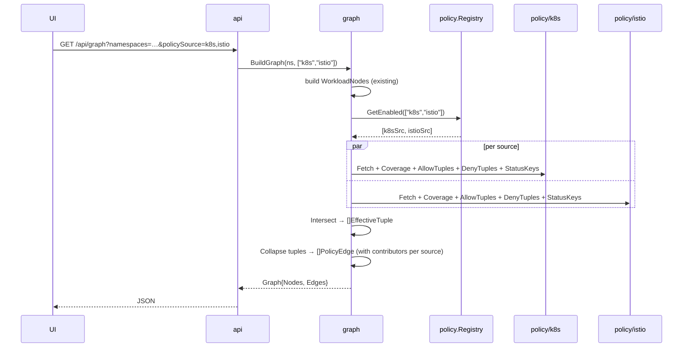

# Multi-Source Policy Graph

Branch: `2-add-istio-l3-l4-authorization-policy-support`
Status: design accepted, not yet implemented.

## Overview

Today the graph renders K8s NetworkPolicy as edges between workloads. This work adds Istio L3/L4 AuthorizationPolicy as a second policy source and a generic abstraction so future sources (Calico, Cilium) plug in without engine changes.

A filter on the UI lets the user choose `k8s` (default), `istio`, or both. When both are selected the backend returns the **intersection** — an edge exists only where every requested source allows the traffic. This matches runtime behavior: traffic only flows if all in-path policies allow it.

## Motivation

- Clusters running both CNI-level NetworkPolicy and Istio AuthorizationPolicy commonly use them in complementary roles (e.g. K8s NP for pod-level allow lists, Istio AuthPolicy for cross-namespace identity). The visualizer must reflect actual reachability, not one layer in isolation.
- User indicated the same problem will recur with Calico and Cilium. A one-off Istio integration would force a second refactor later.
- Status keys exist today for K8s NP diagnostics — same diagnostic surface is needed for Istio (out-of-mesh selectors, deny-all empty rules, unresolved CUSTOM action).

## Scope

**In scope (this branch):**

- Istio `AuthorizationPolicy` (`security.istio.io/v1`), actions `ALLOW` and `DENY`, L3/L4 fields only:
  `from.source.{namespaces, principals, ipBlocks, notNamespaces, notPrincipals, notIpBlocks}`,
  `to.operation.{ports, notPorts}`,
  `selector.matchLabels`, root-NS (`istio-system`) mesh-wide scope.
- Generic `PolicySource` interface in `internal/policy/`. K8s NP code retrofitted into it (see [ADR 0001](decisions/0001-generic-policy-source-abstraction.md)).
- Per-source coverage model: `DefaultAllow`, `DefaultDeny`, `NotApplicable`.
- Intersection engine that operates on `(srcID, dstID, port, protocol)` tuples regardless of source.
- API param `policySource` (multi-value, defaults to `k8s`).
- New status keys (see below).

**Out of scope (documented gaps):**

- L7 fields: `paths`, `methods`, `hosts`, `headers`, `requestPrincipals`. [ADR 0004](decisions/0004-l3-l4-scope.md).
- `PeerAuthentication` / mTLS strict-vs-permissive interaction with `principals` matching. [ADR 0004](decisions/0004-l3-l4-scope.md).
- Ambient waypoint **egress** policy enforcement. Istio sidecar/ztunnel L4 enforcement is destination-side; egress is treated as "K8s-only" for now.
- `AUDIT` action (logs only, no traffic effect).
- `CUSTOM` action (delegates to external authz — cannot resolve statically). Surfaced via status key instead.
- Calico / Cilium implementations. Interface ready, concrete sources to follow.

## Architecture

```
internal/
  k8s/          existing — raw client-go wrapper for core objects
  istio/        NEW — thin wrapper for security.istio.io/v1 client
  policy/       NEW — generic policy plane
    source.go     PolicySource interface, AllowTuple, PolicyRef, CoverageMode
    registry.go   Register(source), GetEnabled([]string) []PolicySource
    intersect.go  Intersect(sources, nodes) []EffectiveTuple
    k8s/          K8s NP implementation (moved from internal/graph)
    istio/        Istio AuthPolicy implementation
  graph/        orchestration only
    workload.go   builds WorkloadNodes (unchanged)
    build.go      calls policy.Intersect, folds tuples → []PolicyEdge for UI
    node.go, statusKeys.go (unchanged)
  api/          handler reads ?policySource= and passes to graph builder
```

**Reasoning:** the engine in `internal/policy/intersect.go` has zero knowledge of K8s or Istio. Adding Calico is: write `internal/policy/calico/source.go` implementing the interface, register it, add `calico` to the API param whitelist. No edits to the engine or to other sources.

See [policy-source-interface.md](policy-source-interface.md) for interface and algorithm detail.

## Data flow



## Filter modes (UI / API)

| `policySource` | Behavior |
|---|---|
| `k8s` (default) | Today's behavior preserved exactly. Only K8s NP fetched; intersection trivial (N=1). |
| `istio` | Istio source only. Out-of-mesh workloads marked with status key. |
| `k8s,istio` | Both fetched. Intersection at tuple level. Edges show contributors from each source. |

Default remains `k8s` because not every cluster runs Istio. Existing users see no behavior change.

## Edge representation

`PolicyEdge` gains:

```go
type PolicyEdge struct {
    // existing fields preserved
    Contributors map[string][]PolicyRef `json:"contributors,omitempty"`
}
```

`Contributors` is keyed by source name (`"k8s"`, `"istio"`). Existing `PolicyName` field is filled from the first K8s contributor when present (backward compat for any UI code that hasn't been updated yet).

UI rendering (separate work, summary only):

- Edge with only `contributors.k8s` → existing style.
- Edge with only `contributors.istio` → Istio badge / distinct color.
- Edge with both → combined badge.
- Click → side panel splits into two collapsible sections (K8s policies, Istio policies). Empty sections hidden.

## Status keys

Each source owns its diagnostics. Naming convention: `<source>.<key>`.

| Key | Source | Trigger |
|---|---|---|
| `istio.AuthPolicyOnOutOfMeshWorkload` | istio | AuthPolicy selector matches a workload whose NS lacks `istio.io/dataplane-mode=ambient`. Policy has no runtime effect. |
| `istio.AuthPolicyDenyAll` | istio | ALLOW policy targets a workload with empty `rules:` → denies all traffic to it. |
| `istio.CustomAuthzUnresolved` | istio | CUSTOM action delegates to external authz; static analysis cannot determine effect. |
| `k8s.EgressUnmatchedByIstio` | (cross-source, computed only when both sources requested) | K8s NP allows egress to a destination that no Istio AuthPolicy permits as inbound source — runtime traffic will be K8s-allowed but Istio-blocked. |

Existing K8s status keys retained unchanged.

## Edge cases handled

- **Granularity mismatch.** K8s NP at pod-level + Istio AuthPolicy at NS-level: both sources expand to `(srcPodID, dstPodID, port)` tuples before intersect. Collapse-back step picks the most specific representation that still covers every surviving tuple (NS-level edge only when the full NS membership is preserved).
- **Out-of-mesh workload with AuthPolicy selecting it.** Istio source returns `CoverageNotApplicable` for that workload. Intersection treats `NotApplicable` as allow-all from that source. Status key surfaces the orphan policy.
- **Empty-rule ALLOW.** Istio source returns `CoverageDefaultDeny` with zero allow tuples → no edges originate at or terminate at that workload from the Istio side. Intersection drops them in `k8s,istio` mode. Status key warns.
- **DENY policies.** Aggregated per workload, subtracted from the intersection result. `effective = (∀ source allows) AND NOT (any source denies)`.
- **Port mismatch.** Per-port intersection. K8s rule with no `ports` field = all-ports set; intersected against Istio's restricted set yields Istio's subset.
- **Cross-NS via NS label.** Both sources rely on the auto-injected `kubernetes.io/metadata.name` label (existing assumption from [project memory](../CLAUDE.md)).
- **Root-NS AuthPolicy.** AuthPolicies in `istio-system` apply mesh-wide. The Istio source treats them as targeting every in-mesh workload during coverage + tuple expansion.
- **External / IP-block peers.** Both sources expand to a synthetic external node ID (the CIDR string). Intersection works on those IDs identically to internal workloads.

## Phasing

Three reviewable PRs in sequence:

1. **PR 2a — Abstraction extraction (no behavior change).** Define `PolicySource` interface, move K8s NP logic into `internal/policy/k8s/`, intersection engine handles `N=1` trivially. Existing tests adjusted, no API change.
2. **PR 2b — Istio source.** Add `internal/istio/` client, `internal/policy/istio/` source. Register it. Add `policySource` query param. Backend complete.
3. **PR 2c — Frontend.** Add filter, edge badge, side-panel split.

## Decisions

- [ADR 0001: Generic policy-source abstraction](decisions/0001-generic-policy-source-abstraction.md)
- [ADR 0002: Backend-computed intersection](decisions/0002-backend-computed-intersection.md)
- [ADR 0003: Ambient-mode detection via NS label](decisions/0003-ambient-mode-detection-via-ns-label.md)
- [ADR 0004: L3/L4-only scope](decisions/0004-l3-l4-scope.md)
