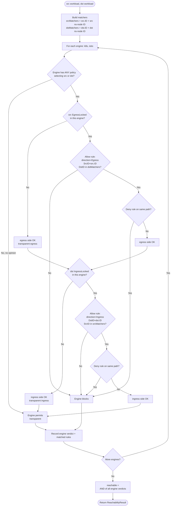

# Reachability: can src talk to dst?

## Context

User wants new feature: given two workloads (or namespace nodes), return whether traffic can flow src → dst, plus the matching allow/deny rules per engine. Existing stub in `internal/store/buildStore.go:187` (`IsNodesReachable`) returns hardcoded `true`. Need real evaluation + HTTP endpoint + UI consumption.

Also clarifies user's side question: **"Does GetNodeData store policies that came from ns?"** — Yes, indirectly. `NodePolicies[workloadID]` contains policies that select the workload via labels, including catch-all (`{}`) selectors that effectively target the whole namespace, and Istio mesh-wide policies from `istio-system` that match the workload. Policies in OTHER namespaces that whitelist this workload as a peer do not appear there — they show up on the rule side (SrcID/DstID of rules in the source policy's ns).

## Approach

### Evaluation flow



**Key invariants the flow encodes:**

- **NS policies vs workload policies handled uniformly via matchers.** A rule with `DstID = nsNodeID` (engine emitted catch-all ns-level peer) matches `dstMatchers` because the ns node ID is in the set. A rule with `DstID = podID` matches via the pod's own ID. No separate code paths needed — same rule walk catches both.
- **Both engines must permit if both have an opinion.** Final verdict is AND across engines (`reachable && reachable && ...`). Two engines AND'd = both must allow.
- **No-opinion engine = transparent.** An engine with no policy selecting either workload (zero entries in `PolicyStatuses` for both src AND dst) contributes `permit` and doesn't subtract — mirrors `IntersectPolicyStatus`'s zero-status filter.
- **DENY subtracts after ALLOW matches.** A deny rule on the same direction + path flips the side to blocked even if an allow rule matched.

### Algorithm (per engine, then AND across engines)

For each engine in `cache.EvaluationResults`:

1. Resolve src/dst identity sets:
   - `srcMatchers = {src.ID, srcNsNodeID}`
   - `dstMatchers = {dst.ID, dstNsNodeID}`
   - If src or dst is itself a namespace node, drop the workload entry — only ns node ID counts.

2. Walk every rule in `engine.AllowByNs` and `engine.DenyByNs` (all namespaces — peer rules live in the peer's policy ns). Skip rules where SrcID or DstID looks like a CIDR (string contains `/` and parses as a CIDR — leverage existing helpers in `policy/networkPolicyHelpers.go` if usable).

3. A rule **matches the path** when either:
   - `direction=Egress` AND `SrcID == src.ID` AND `DstID ∈ dstMatchers`
   - `direction=Ingress` AND `DstID == dst.ID` AND `SrcID ∈ srcMatchers`

4. Partition matched rules into `allowRules` and `denyRules` by `Action`.

5. Locks come from `engine.PolicyStatuses[src.ID].EgressLocked` and `engine.PolicyStatuses[dst.ID].IngressLocked`.

6. Per-direction verdict:
   - `egressOK = !egressLocked || hasAllowEgress`
   - `ingressOK = !ingressLocked || hasAllowIngress`
   - DENY subtracts: any matching deny egress → `egressOK = false`; same for ingress.

7. Engine permits iff `egressOK && ingressOK`. Build a `Reason` string for UI debug.

Effective verdict: `reachable = all engines permit`. Same AND-across-engines model the badge intersection uses (`policy.IntersectPolicyStatus`).

### Types

Add to `internal/store/store.go`:

```go
type ReachabilityResult struct {
    Reachable bool                      `json:"reachable"`
    Engines   map[string]EngineVerdict  `json:"engines"`
}

type EngineVerdict struct {
    Allowed       bool          `json:"allowed"`
    EgressOK      bool          `json:"egressOK"`
    IngressOK     bool          `json:"ingressOK"`
    EgressLocked  bool          `json:"egressLocked"`
    IngressLocked bool          `json:"ingressLocked"`
    AllowRules    []NodeRule    `json:"allowRules,omitempty"` // reuse NodeRule for label resolution
    DenyRules     []NodeRule    `json:"denyRules,omitempty"`
    Reason        string        `json:"reason"`
}
```

Reuse existing `NodeRule` (already resolves DstID → label/ns) for UI display consistency. Pass `idIndex` from `buildWorkloadIDIndex` into the verdict builder.

### HTTP endpoint

`GET /api/reachable?srcId=...&srcNs=...&dstId=...&dstNs=...`

Handler in `internal/api/node-data.go` (sibling to `getNodeInfo`):
- Validate all 4 params present, else 400.
- Cache check: if either ns missing from `cache.NsIndex`, lazy populate via `store.PopulateCache` under the existing mutex (same pattern as `getNodeInfo` originally had — both ns at once).
- Call `store.IsNodesReachable(cache, srcId, srcNs, dstId, dstNs)`.
- Return JSON `ReachabilityResult`.

Register route in `internal/api/api.go`.

### Backend mode reminder

CLAUDE.md says backend Go is **pair-programming only** — Claude doesn't edit Go files unless user says "implement". Plan describes the change; user writes the code.

## Critical files

**Backend (pair-programming — user implements):**
- `internal/store/store.go` — add `ReachabilityResult` + `EngineVerdict`.
- `internal/store/buildStore.go` — replace `IsNodesReachable` stub. Extract helpers: `engineReachability(engine, srcMatchers, dstMatchers, src, dst)`, `isCidrId(id)`, `reasonString(verdict)`. Reuse `toNodeRule` for label resolution.
- `internal/api/node-data.go` — add `getReachability` handler (lazy populate + delegate to store).
- `internal/api/api.go` — register `GET /api/reachable`.
- `internal/store/buildStore_test.go` (new) — table-driven tests with hand-built `Cache`:
  - both engines allow (workload-to-workload)
  - k8s allows workload-to-workload, istio default-deny by lock with no allow → blocked
  - istio deny rule subtracts allow → blocked
  - ns-node peer (DstID = ns node) → reaches every workload in that ns
  - one engine transparent (no policy, zero PolicyStatus) → doesn't subtract — same semantics as `IntersectPolicyStatus_NoOpinionEngineDoesNotOverClaim`
  - CIDR rule ignored
  - missing ns triggers populate path? (skip — integration concern)

**Frontend (no restrictions):**
- `ui/src/data/policies.ts` — mirror `ReachabilityResult` + `EngineVerdict` TS types with lowercase fields.
- `ui/src/api/client.ts` — add `fetchReachability(srcId, srcNs, dstId, dstNs)`.
- `ui/src/store/graphStore.ts` — `reachability: ReachabilityResult | null`, `reachabilityLoading`, `loadReachability(src, dst)` action; trigger from new UI control (probably shift-click second node, or "Set as B" button in DetailPanel — confirm with user before building UI).
- `ui/src/components/ReachabilityPanel.tsx` (new) — verdict header (green check / red X) + per-engine cards (locks, matched allow rules, matched deny rules, reason).

## Reuse opportunities

- `buildWorkloadIDIndex` (`buildStore.go:125`) — already builds the cross-ns workload lookup we need for label resolution and ns-node ID.
- `toNodeRule` (`buildStore.go:135`) — already resolves dst labels; reuse for matched-rule display.
- `policy.IntersectPolicyStatus` pattern — same AND-with-transparency model; reachability AND across engines uses same "transparent engine doesn't subtract" semantics.
- `nsNodeData` / `data.NsIndex[ns].NSNode.ID` (`buildStore.go:179`) — already pulls the ns-node ID.

## Exploration findings (reference while implementing)

### Rule shape (`internal/models/rule.go`)
- `Rule.SrcID` / `Rule.DstID` are strings — pod workload ID, namespace-node ID, OR CIDR literal (`"10.0.0.0/8"` etc).
- `Rule.Action` = `ActionAllow` (zero-value) or `ActionDeny`. K8s engine never sets Deny — k8s default-deny is **structural** (no rule emitted), not a deny rule.
- `Rule.Direction` = `Egress` or `Ingress`. Engine populates direction-aware accumulators independently.

### K8s rule generation (`internal/policy/k8spolicy/buildRules.go`)
- Pod-to-pod allow: concrete pod IDs on both sides via `utils.IndexLabelMatch`.
- `namespaceSelector` peer (no podSelector): peer ID = namespace node ID. **No fan-out** to concrete pods.
- Catch-all `podSelector: {}`: peer ID = namespace node ID of the matched ns.
- Both selectors: fans out per matched ns → namespace-node OR concrete pod IDs.
- ipBlock CIDR: peer ID = CIDR string literal.
- Empty ingress in a policy = no rule emitted (default-deny via lock + no allow).

### Istio rule generation (`internal/policy/istio/buildRules.go`, `evaluate.go`)
- `from.source.namespaces`: peer ID = namespace node ID. No fan-out.
- `from.source.ipBlocks`: **NOT** yet rendered — currently dropped in `expandFromSource`. TODO upstream; reachability should not depend on it.
- DENY rules: `Action = ActionDeny` stamped post-build in `evaluate.go` after `splitPoliciesByAction`.
- ALLOW vs DENY split at `splitPoliciesByAction` (`evaluate.go:88`).

### NodePolicies population
- k8s (`buildStatusKeys.go:79`): policies that select workload via `podSelector` + namespace match. Catch-all selector selects namespace node only.
- istio (`buildPolicyStatus.go:87`): same discipline. Root-ns (`istio-system`) policies included **if** they select the workload via match labels.
- **Namespace nodes** (`Type == NodeTypeNamespace`) match only catch-all policies.
- Policies in OTHER namespaces that whitelist this workload as a peer do **not** appear in this workload's `NodePolicies` — they only show on the rule side.

### Lock semantics (drives `egressLocked` / `ingressLocked` in verdict)
- k8s (`buildStatusKeys.go:102-119`): `IngressLocked = true` if ANY selecting policy has `PolicyTypeIngress` OR no PolicyTypes set. `EgressLocked` only fires on explicit egress PolicyType. Any selecting policy gates the dimension regardless of rule content.
- istio (`buildPolicyStatus.go:221`): `IngressLocked = true` if ANY selecting policy exists. Egress fields stay false — Istio AuthZ is ingress-only.

### Existing helpers to reuse
- `buildWorkloadIDIndex` (`buildStore.go:125`) — workload-ID → WorkloadNode lookup.
- `toNodeRule` (`buildStore.go:135`) — already resolves DstID → label/ns.
- `data.NsIndex[ns].NSNode.ID` — namespace node ID for matcher set.
- `nsNodeData` (`buildStore.go:178`) — wrapper for namespace-node `GetNodeData`.

### CIDR detection
- Simplest test: `strings.Contains(id, "/")` plus a `net.ParseCIDR` check. Both engine generators use the raw CIDR string as the peer ID, so the heuristic is reliable.

## Verification

Backend:
- `go test ./internal/store/...` — new table tests pass.
- `go test ./...` — no regressions in policy / graph packages.
- `go run main.go` with `DEMO_MODE=true`; curl `/api/reachable` with two demo workloads — verdict + matched rules JSON.

Frontend:
- `cd ui && npm run dev`; click workload A, "set as src"; click workload B, "set as dst"; verify panel shows verdict + per-engine allow/deny rules.
- Toggle to a scenario where istio denies but k8s allows → effective `reachable=false`, engine cards explain why.

E2E (optional, mirrors `tests/combined/test_intersection.py`):
- Apply `allow_fe_to_be` scenario; assert `/api/reachable?src=frontend&dst=backend` returns `reachable=true`, k8s lists the allow rule, istio is transparent (no locks).
