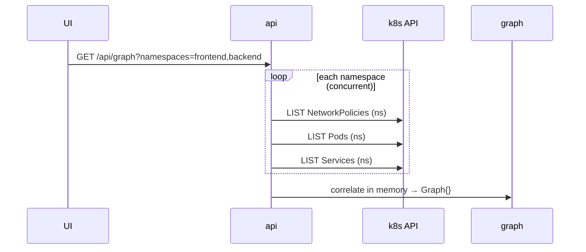
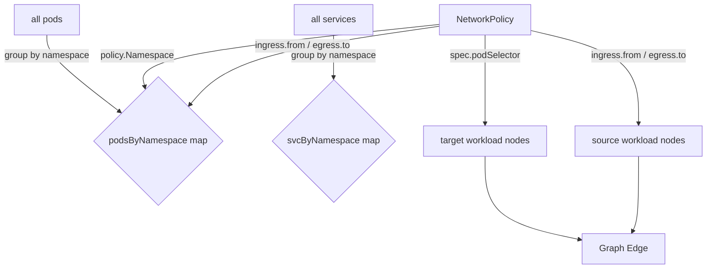

# Architecture

## Package Structure

```
main.go               → wires dependencies, starts HTTP server
internal/
  k8s/                → k8s API calls only, returns raw k8s types
  graph/              → correlation logic, returns Graph struct
  api/                → HTTP handlers (api.go = routing, network-policy.go = handlers)
ui/                   → Vite/React frontend
```

**Reasoning:** each layer knows only about the layer below it. `api` calls `graph`, `graph` calls `k8s`. None are globals — the `*kubernetes.Clientset` is created once in `main.go` and passed down explicitly.

---

## k8s Data Fetching

Scoped per selected namespace — frontend sends `?namespaces=a,b`, backend queries only those. Calls within a namespace run concurrently via `errgroup`.



**Reasoning:** cluster-wide LIST requires cluster-scoped RBAC which is often unavailable. Per-namespace queries work with namespace-scoped permissions and avoid pulling data the user never sees. Concurrency keeps latency low.

---

## Correlation

Pre-group pods and services by namespace once, then all policy lookups are O(1) namespace filter + label match:



**Reasoning:** NetworkPolicies are namespace-scoped — a policy in `ns=X` can only target pods in `ns=X`. Pre-grouping reduces the inner loop from all pods to pods-in-namespace, cutting iterations by ~10x on a typical cluster.

### Two selectors per policy

| Selector | Meaning |
|---|---|
| `spec.podSelector` | which pods this policy *protects* (target node) |
| `ingress[].from` / `egress[].to` | which pods traffic is *allowed from/to* (source node) |

Both lookups hit the same `podsByNamespace` map.

---

## Workload Node Identity

**The unit is the pod, not the Service.** NetworkPolicies apply to pods via `podSelector` — a Service is just a load balancer on top and is irrelevant to policy enforcement.

**Deduplication key: pod label set.** Pods sharing the same labels are the same workload by definition — any policy that selects one selects all of them.

```
group pods by canonical label (e.g. app=api-server)
→ one WorkloadNode per group
→ check if any Service selector matches those pods
   yes → node.type = "service"
   no  → node.type = "deployment"
```

**Why not group by Service?** A pod with no Service but an egress policy would be invisible. Pods are the real policy target — Service presence is just metadata that determines the node type badge in the UI.

**Why not group by owner (Deployment/StatefulSet/DaemonSet)?** Requires walking `ownerReferences` up the chain and extra LIST calls for ReplicaSets. Label grouping is simpler and produces the same result since k8s controllers always stamp pods with consistent labels.
